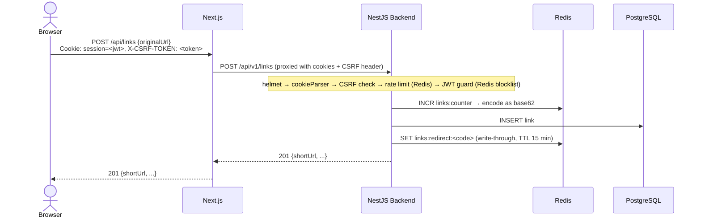
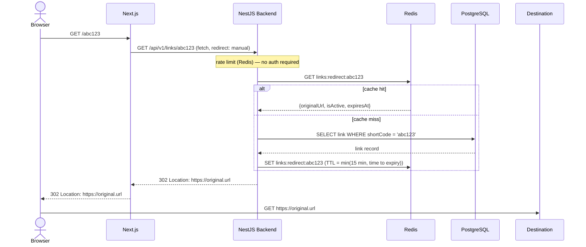

# Request Flow

Sequence diagrams tracing requests end-to-end through the stack.

**Stack:** Browser → Next.js (BFF) → NestJS backend → Redis / PostgreSQL

---

## Flow 1: Create Short Link (`POST /api/links`)

---

## Flow 2: Resolve a Short Link (`GET /:code`)

---

## Middleware / Guard pipeline

Every request passes through this chain in order before reaching a controller.

| # | Layer | Scope | What it does |
|---|---|---|---|
| 1 | `helmet` | Global (Express) | Sets security headers (CSP, HSTS, etc.) |
| 2 | `express.json` | Global (Express) | Parses JSON body, 16 KB limit |
| 3 | `cookieParser` | Global (Express) | Parses `Cookie` header into `req.cookies` |
| 4 | `CsrfService` | Global (Express) | Double-submit cookie CSRF validation — blocks mutations without a valid `X-CSRF-TOKEN` |
| 5 | `RateLimiterGuard` | Global (APP_GUARD) | Fixed-window counter in Redis keyed by client IP; 100 req / 60 s |
| 6 | `JwtGuard` | Route-level | Verifies session JWT from cookie; checks Redis JTI blocklist (handles logout invalidation); sets `req.user` |
| 7 | `ValidationPipe` | Global (NestJS) | Whitelists and transforms DTOs; rejects unknown fields |

---

## Key design notes

**Next.js as BFF proxy** — `proxyBackend()` in `backend.ts` forwards the browser's cookies and `X-CSRF-TOKEN` header verbatim to the NestJS backend. The `/:code` redirect route is the exception: it calls the backend directly via `fetch()` and manually proxies the `302` response back to the browser.

**CSRF — double-submit cookie pattern** — On login the backend sets a `psifi.x-csrf-token` HttpOnly cookie. The frontend reads a CSRF token from `GET /api/v1/auth/me` and attaches it as the `X-CSRF-TOKEN` request header. The backend validates that both match, preventing cross-site form submissions.

**Session JWT + Redis blocklist** — Sessions are stateless JWTs stored in a `session` HttpOnly cookie. Logout is handled by writing the token's `jti` claim into Redis with a TTL matching the token's remaining lifetime; `JwtGuard` checks this blocklist on every authenticated request.

**Short-code generation** — A monotonic counter is stored in Redis (`links:counter`), seeded at `62⁵ - 1` on first boot. Each new link atomically increments the counter and encodes the result as base62 (minimum 6 characters). This avoids random collisions at the cost of sequential predictability.

**Redirect caching — two strategies**
- *Write-through* on create: the new link is immediately written to Redis so the redirect endpoint can serve it without a DB round-trip.
- *Cache-aside* on read: Redis is checked first; on a miss the DB is queried and the result is populated back into Redis with a TTL of `min(15 min, time until link expiry)`.
- *Invalidation* on delete: the cache entry is explicitly deleted when a link is soft-deleted.
